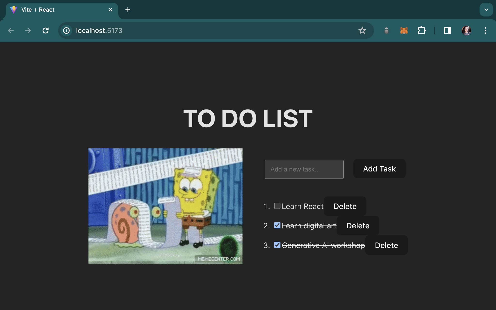

# React + Vite

To Do List application is been created where you can Add Tasks, Delete Tasks, Check & Uncheck Tasks

How to run on your local machine?
1) npm install
2) npm run dev

This is how the interface of To Do List Webpage looks
